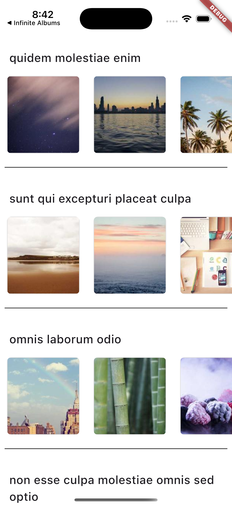

# Infinity Albums

Infinity Albums is a photo album application that allows users browse photos.

## Description

Infinity Albums provides a seamless experience for organizing your photos into albums.

## Features

- Uses Clean Architecture
- Supports data caching
- Supports local data storage
- Uses Bloc State Management
- Comes with Unit and Widget tests

## Screenshot

## Download

Download the latest version of Infinity Albums from the link below:

[Download Infinity Albums APK](https://drive.google.com/file/d/168zR0PT3DHEY8aqwApCSCfka6Y2fR7if/view?usp=sharing)

## License

This project is licensed under the MIT License - see the [LICENSE](LICENSE) file for details.
